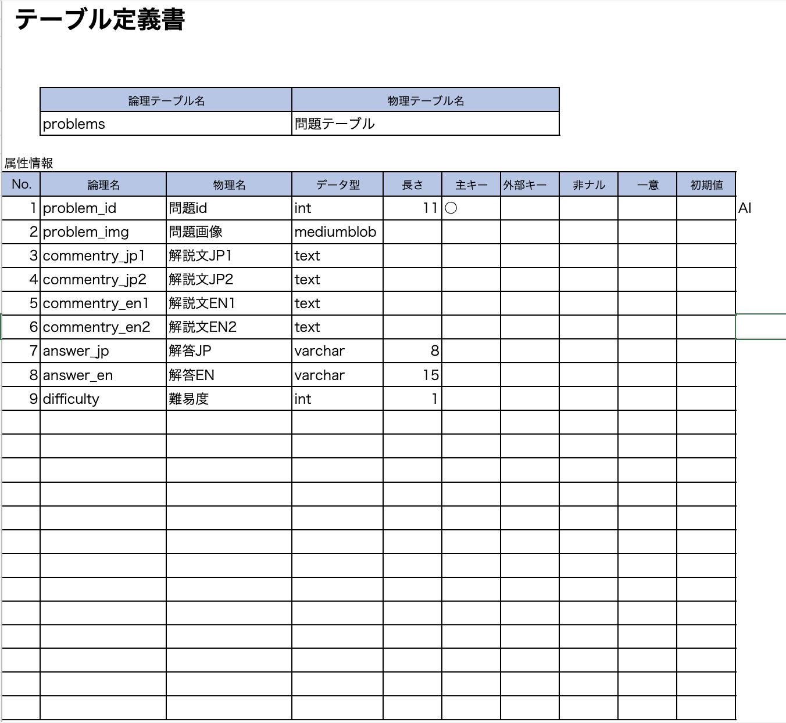

# DB設計書

##  テーブル定義書

### 

--------

## テーブルカラム一覧表

### 問題テーブル（problems）
 |和名|属性名|型|PK|NN|FK|AI|
 |:---|:---|:---|:---|:---:|:---:|:----:|
 |問題ID|problem_id|int(11)|○|||○|
 |問題画像|problem_img|mediumblob|||||
 |解説文_JP1|commentry_jp1|text|||||
 |解説文_JP2|commentry_jp2|text|||||
 |解説文_EN1|commentry_en1|text|||||
 |解説文_EN2|commentry_en2|text|||||
 |解答_JP|answer_jp|varchar(8)|||||
 |解答_EN|answer_en|varchar(15)|||||
 |難易度|difficulty|int(1)|||||

 
