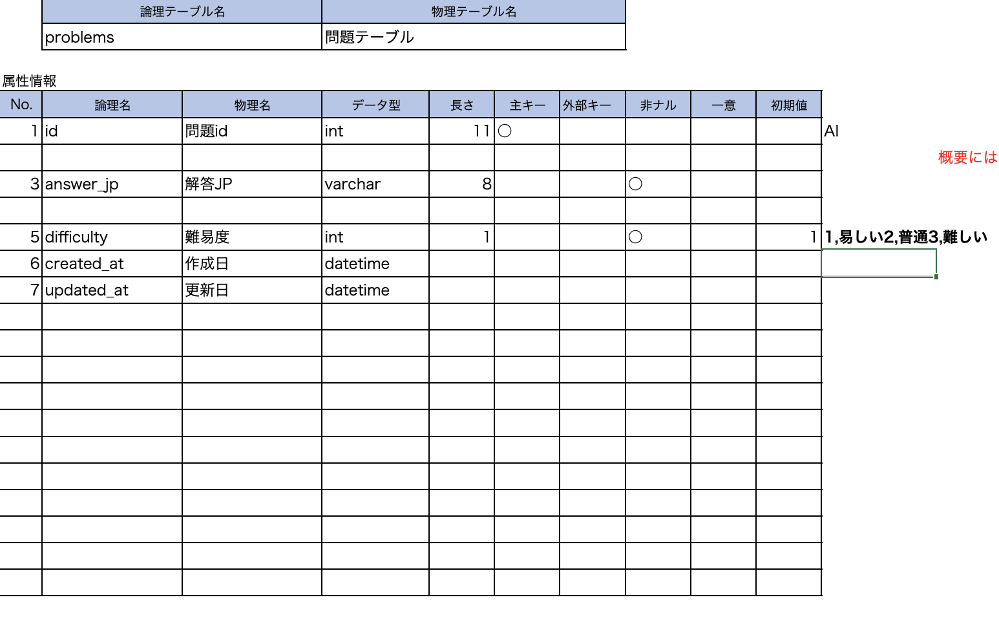

# DB設計書

##  テーブル定義書

### 

--------

## テーブルカラム一覧表

### 問題テーブル（problems）
 |和名|属性名|型|PK|NN|FK|AI|default|Ex|
 |:---|:---|:---|:---|:---:|:---:|:----:|:--:|:--:|
 |問題ID|problem_id|int(11)|○|○||○|||
 |解答_JP|answer_jp|varchar(8)||○|||||
 |難易度|difficulty|int(1)||○|||1|1:易しい2:普通3:難しい|
 |作成日|created_at|datetime|||||||
 |更新日|updated_at|datetime|||||||

 
